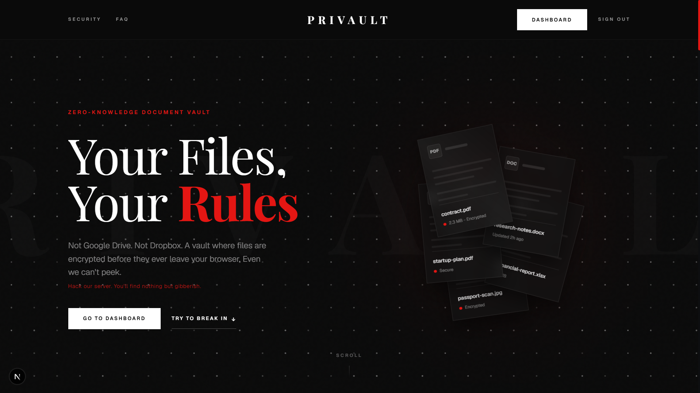
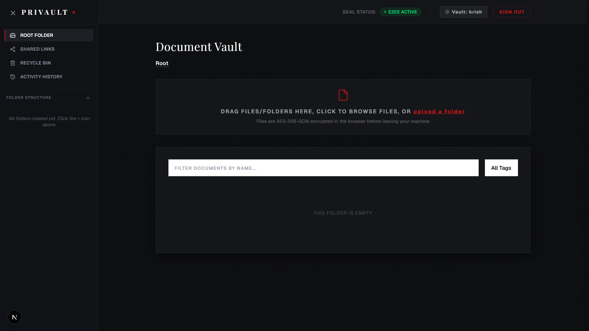
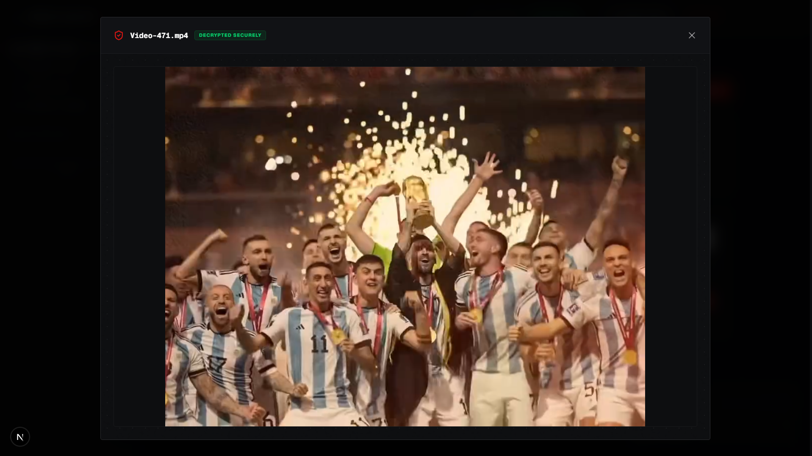
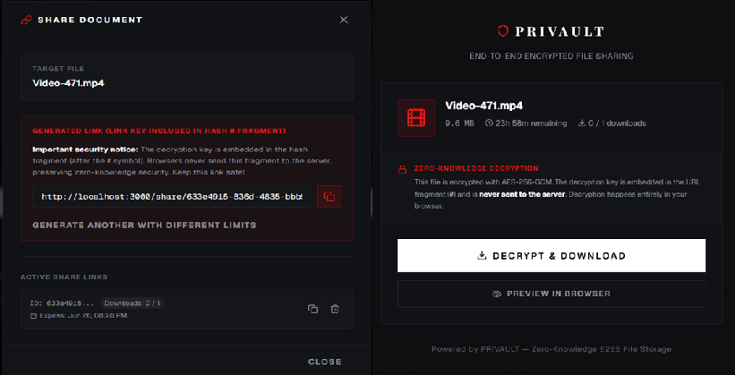

# 🛡️ Privault — Zero-Knowledge Encrypted Document Vault

**Your files, your keys. The server never sees plaintext.**

Privault is a full-stack, zero-trust document vault where every byte is encrypted in the browser before it touches the wire. The backend stores only indistinguishable ciphertext and cryptographically blinded authentication material — a full database dump yields nothing of value to an attacker.

Built with Rust (Axum) + Next.js, powered by the Web Crypto API.

<p align="center">
  
</p>

---

## Table of Contents

- [Why Privault?](#-why-privault)
- [Security Architecture](#-security-architecture)
- [Features](#-features)
- [Screenshots](#-screenshots)
- [Tech Stack](#-tech-stack)
- [Project Structure](#-project-structure)
- [API Overview](#-api-overview)
- [Getting Started](#-getting-started)
- [Production Checklist](#-production-checklist)
- [Roadmap](#-roadmap)
- [License](#-license)

---

## 🔐 Why Privault?

Most "secure cloud storage" services hold the keys. If they're breached, your data is exposed. Privault is designed so that **we cannot give your files to anyone even if we wanted to**:

- **Zero-knowledge authentication** — your password is hashed client-side before transmission; the server receives only a verifier, which is Argon2id-hashed again before storage.
- **Client-side encryption** — files are encrypted with AES-256-GCM before upload. The encryption key itself is wrapped with your RSA-2048 public key. The server never holds a plaintext key.
- **Non-extractable KEK** — your Key Encryption Key lives in browser memory flagged as `non-extractable` via the Web Crypto API. It can never be exported, even from your own browser session.
- **No JWTs, no secrets on the server** — authentication uses opaque session tokens, SHA-256 hashed before storage. There are no JWTs to steal.

---

## 🔒 Security Architecture

### Key Hierarchy

```
Master Password (in your head)
  ├── PBKDF2(auth_salt, 100k) ──▶ Auth Verifier ──▶ Server (Argon2id) ──▶ DB
  └── PBKDF2(kek_salt, 100k) ──▶ KEK (AES-256, non-extractable, in memory)
                                    └── wraps ──▶ RSA Private Key (in memory)
                                                       └── unwraps ──▶ Per-file DEK
                                                                          └── decrypts ──▶ File
```

### Authentication Flow

1. **Registration**: Browser generates two random salts + RSA-2048 keypair. Password-derived KEK wraps the private key. Auth verifier (separately derived) is sent to the server, which Argon2id-hashes it before storage.
2. **Login**: Browser fetches salts, re-derives auth verifier, sends it. Server verifies against Argon2id hash and returns the wrapped private key. KEK is re-derived from password to unwrap it in memory.
3. **Locked state**: On page refresh, the session persists but the KEK is gone. The vault is locked — re-enter your password to re-derive the KEK and regain access. No plaintext key material ever touches disk.

### File Encryption

Every uploaded file gets a **unique** random AES-256-GCM Data Encryption Key (DEK). The file is encrypted with this DEK, and the DEK is encrypted with your RSA public key. The server stores only:
- The ciphertext blob (indistinguishable from random noise)
- The RSA-wrapped DEK

Decryption reverses the chain: RSA private key unwraps the DEK, DEK decrypts the file — all in the browser.

### Ephemeral Sharing

Share links use an ephemeral Link Key (random AES-256). The DEK is unwrapped locally, re-encrypted with the Link Key, and the Link Key itself is encrypted with your public key for later retrieval. The link key travels in the URL **hash fragment** (`#key`) — never sent to the server, never logged in referrer headers.

### Session Fingerprinting & Lockout

- **Session Fingerprinting:** Active session tokens are bound to a hash of the client's IP prefix (first 3 octets for IPv4, first 4 hextets for IPv6) and the first 64 characters of their User-Agent. Access from a mismatched network or device is immediately rejected with HTTP 401.
- **Sliding Expiry:** Sessions feature a 24-hour idle timeout. Each active request extends `expires_at` (touch-to-refresh) if more than 1 hour has elapsed since last use, up to a hard cap of 7 days from creation.
- **Mnemonic Lockout:** The `/api/recovery/recover` endpoint tracks failed recovery attempts per username. After 10 consecutive failures, the account is locked for 24 hours to block dictionary attacks.

---

## ⚡ Features

| Feature | Detail |
|---|---|
| **🔐 End-to-End Encryption** | AES-256-GCM per-file DEK, RSA-2048 key wrapping, PBKDF2 key derivation — all client-side via Web Crypto API |
| **📁 Folder Hierarchy** | Nested folders, recursive stats, batch folder upload preserving directory structure |
| **🔗 Cryptographic Share Links** | Ephemeral link key in URL hash fragment, expiration dates, download limits, revocable |
| **♻️ Trash & Recovery** | Soft-delete with restore, recursive folder trash, automatic purge of expired items (configurable retention) |
| **🏷️ Tagging** | Custom tags with colors, attach to documents, filter and organize |
| **📋 Audit Log** | Append-only activity log: logins, uploads, downloads, shares, deletions — all tracked |
| **🔑 BIP39 Recovery** | 12-word mnemonic phrase for account recovery, forgot-password flows, and password rotation without data loss |
| **🛡️ Security Headers** | Strict CSP, HSTS, X-Content-Type-Options, Referrer-Policy, and Permissions-Policy enforced on frontend/backend |
| **👥 Session Hardening** | IP/UA prefix fingerprinting, touch-to-refresh sliding expiry, and 24h/7d session timeouts |
| **🚀 PDF Virtualization** | Optimized PDF previewing with on-scroll page unloading and IntersectionObserver canvas recycling, reducing GPU memory by 95% |
| **🖼️ Thumbnails** | Encrypted thumbnail previews for supported document types |
| **⚡ Web Worker Crypto** | All encryption/decryption offloaded to a background thread — UI stays responsive |
| **🏖️ Sandbox Mode** | Full offline simulation using ephemeral in-memory keys — try before you commit |

---

## 📸 Screenshots

<p align="center">
  
</p>

<p align="center">
  <em>An empty vault, ready for your first encrypted file.</em>
</p>

<br>

<p align="center">
  
</p>

<p align="center">
  <em>Files are decrypted in your browser using a non-extractable KEK — the server never sees a single plaintext byte.</em>
</p>

<br>

<p align="center">
  
</p>

<p align="center">
  <em>Share files via link keys that live in the URL fragment — never on our servers.</em>
</p>

---

## 🛠 Tech Stack

| Layer | Technology |
|---|---|
| **Frontend** | Next.js 16 (App Router), React 19, Tailwind CSS 4, Framer Motion |
| **State / Data** | TanStack Query 5, TanStack Virtual 3 |
| **Backend** | Rust, Axum 0.7, Tokio, Tower HTTP |
| **Database** | PostgreSQL (via Supabase), SQLx 0.7 with compile-time query checks |
| **Auth / Sessions** | SHA-256 hashed session tokens, Argon2id server-side hashing |
| **Client Crypto** | Web Crypto API: AES-GCM-256, RSA-OAEP-2048, PBKDF2-HMAC-SHA256 |
| **Server Crypto** | Argon2id, SHA-256, random token generation via `rand` + `base64` |
| **Deployment** | Vercel (frontend), Railway / Render (backend), Docker multi-stage build |

---

## 📁 Project Structure

```
privault/
├── backend/                    # Rust / Axum API server
│   ├── src/
│   │   ├── main.rs             # Entrypoint, CORS, DB pool, routes, trash cleanup cron
│   │   ├── error.rs            # Unified AppError with HTTP mapping
│   │   ├── auth/               # Register, login, logout, session middleware
│   │   ├── audit/              # Append-only audit event logger
│   │   ├── documents/          # CRUD, upload/download, thumbnails, batch folder upload
│   │   ├── folders/            # Nested folder CRUD, recursive stats
│   │   ├── shares/             # E2EE share link generation, public download
│   │   ├── tags/               # Tag CRUD, document tagging
│   │   ├── trash/              # Soft-delete, restore, permanent delete, auto-cleanup
│   │   └── recovery/           # BIP39 mnemonics, account recovery, password change
│   ├── Cargo.toml
│   ├── Dockerfile
│   └── uploads/ & thumbnails/  # Encrypted blob storage (local FS)
├── frontend/                   # Next.js 16 application
│   ├── src/
│   │   ├── app/                # App Router: login, register, dashboard, share, security
│   │   │   ├── context.tsx     # Auth state machine (loading → unauthenticated → locked → unlocked)
│   │   │   └── layout.tsx      # Root layout with theme, fonts, unlock modal
│   │   ├── components/         # React components
│   │   │   ├── dashboard/      # UploadZone, DocumentTable, Header, BatchPanel
│   │   │   ├── landing/        # Hero, Nav, Features, Footer
│   │   │   └── ui/             # shadcn/ui primitives
│   │   ├── lib/
│   │   │   ├── crypto.ts       # Client-side E2EE engine
│   │   │   ├── api.ts          # API client with auto-auth injection
│   │   │   └── bip39-words.ts  # BIP39 wordlist
│   │   └── workers/
│   │       └── crypto.worker.ts # Web Worker for off-thread crypto
│   ├── package.json
│   └── next.config.ts
├── database/                   # PostgreSQL migrations (apply in order)
│   ├── schema.sql
│   ├── migration_folders.sql
│   ├── migration_tags.sql
│   ├── migration_share_links.sql
│   ├── migration_recovery.sql
│   ├── migration_trash.sql
│   ├── migration_audit_logs.sql
│   └── ...
└── docs/                       # Architecture plans, roadmap, improvement notes
```

---

## 📡 API Overview

All authenticated endpoints require `Authorization: Bearer <session_token>`.

### Authentication
| Method | Route | Description |
|---|---|---|
| `GET` | `/api/auth/salt/:username` | Fetch user's cryptographic salts |
| `POST` | `/api/auth/register` | Create account with key material |
| `POST` | `/api/auth/login` | Authenticate and retrieve wrapped private key |
| `POST` | `/api/auth/logout` | Invalidate all sessions |
| `GET` | `/api/me` | Get current user profile |

### Documents
| Method | Route | Description |
|---|---|---|
| `GET` | `/api/documents` | List documents (filter by `folder_id`) |
| `POST` | `/api/documents` | Upload encrypted document |
| `GET` | `/api/documents/:id` | Get document metadata |
| `DELETE` | `/api/documents/:id` | Soft-delete document |
| `GET` | `/api/documents/:id/download` | Download encrypted blob |
| `POST` | `/api/documents/upload-folder` | Batch folder upload |

### Folders
| Method | Route | Description |
|---|---|---|
| `GET` | `/api/folders` | List subfolders (filter by `parent_id`) |
| `POST` | `/api/folders` | Create folder |
| `DELETE` | `/api/folders/:id` | Soft-delete folder (recursive) |
| `PATCH` | `/api/folders/:id` | Rename folder |
| `GET` | `/api/folders/:id/stats` | Recursive file/folder counts |

### Shares
| Method | Route | Description |
|---|---|---|
| `POST` | `/api/shares` | Create share link |
| `GET` | `/api/shares/mine` | List my share links |
| `GET` | `/api/shares/:id` | Get public share metadata |
| `DELETE` | `/api/shares/:id` | Revoke share link |
| `GET` | `/api/shares/:id/download` | Download shared encrypted blob |

### Trash & Recovery
| Method | Route | Description |
|---|---|---|
| `GET` | `/api/trash` | List trashed items |
| `POST` | `/api/trash/restore/:type/:id` | Restore item |
| `DELETE` | `/api/trash/empty` | Permanently empty trash |
| `DELETE` | `/api/trash/:type/:id` | Permanently delete item |
| `POST` | `/api/recovery/store-key` | Store recovery-wrapped key |
| `POST` | `/api/recovery/recover` | Recover account via BIP39 phrase |
| `POST` | `/api/recovery/change-password` | Rotate master password |

---

## 🚀 Getting Started

### Prerequisites

- Rust toolchain (1.70+)
- Node.js (18+)
- PostgreSQL instance (Supabase, Neon, or local)

### 1. Database

Apply migrations from `database/` in chronological order against your PostgreSQL instance.

### 2. Backend

```bash
cp .env.example .env
# Edit .env: DATABASE_URL, CORS_ORIGIN, PORT
cargo run --package privault-backend
```

The server starts on `http://localhost:8080` with local `uploads/` and `thumbnails/` directories.

> **Supabase / PgBouncer users:** append `.statement_cache_capacity(0)` to the SQLx pool options in `main.rs` — this is already configured.

### 3. Frontend

```bash
cd frontend
cp .env.local.example .env.local
# Edit NEXT_PUBLIC_API_URL to point at your backend
npm install
npm run dev
```

Open [http://localhost:3000](http://localhost:3000).

---


## 🗺️ Roadmap

Privault is actively developed. Upcoming work:

- **Desktop client (Tauri)** — native desktop app with the same Web Crypto foundation, system-tray integration, and offline-first sync
- **Browser extension** — encrypt files in Gmail, Drive, Notion before they leave the page
- **Team vaults** — shared encrypted workspaces with role-based access
- **Audit log export** — signed, downloadable activity history
- **CLI companion** — encrypt and decrypt files from the terminal
- **Recovery v2** — optional social / Shamir's secret sharing recovery flows

---

## 📜 License

[MIT](LICENSE) — Copyright (c) 2026 Krushna Raut.

You are free to use, modify, and distribute this software. See the [LICENSE](LICENSE) file for the full text.
